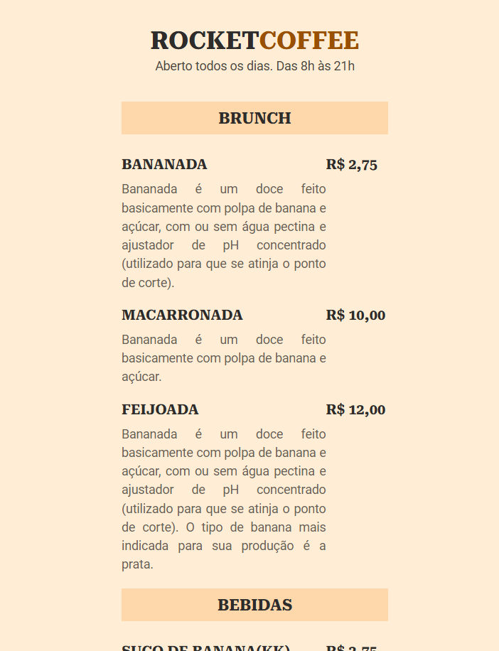

# RocketCoffee ☕

RocketCoffee é uma página simples e elegante que apresenta um menu de brunches e bebidas para um café fictício. Este projeto utiliza apenas **HTML5** e **CSS3** para criar uma interface responsiva e funcional.


---

## 📝 Descrição do Projeto

O projeto simula o cardápio de um café chamado **RocketCoffee**, incluindo:  
- Um cabeçalho com o nome do estabelecimento e horários de funcionamento.  
- Listas organizadas que exibem itens de **brunch** e **bebidas**, com descrições e preços.  
- Estrutura básica para adicionar ou expandir o conteúdo no futuro.

O design é simples, mas pode ser facilmente adaptado para projetos mais complexos com backend ou frameworks modernos.

---

## 🚀 Tecnologias Utilizadas

- **HTML5:**  
  Estruturação semântica e hierarquia de conteúdo.  

- **CSS3:**  
  Aplicação de estilos para uma apresentação atrativa.  

---

## 🌟 Funcionalidades

- **Menu Dividido por Categorias:**  
  Apresenta opções de brunch e bebidas separadamente para facilitar a navegação.  

- **Informações Detalhadas:**  
  Cada item possui uma breve descrição e seu respectivo preço.  

- **Design Flexível:**  
  Pronto para expandir ou estilizar usando frameworks modernos como Tailwind CSS ou Bootstrap.  

---

## 🛠️ Estrutura de Arquivos

```plaintext
Cardapio/
├── index.html   # Estrutura principal da página
├── style.css    # Arquivo de estilos

